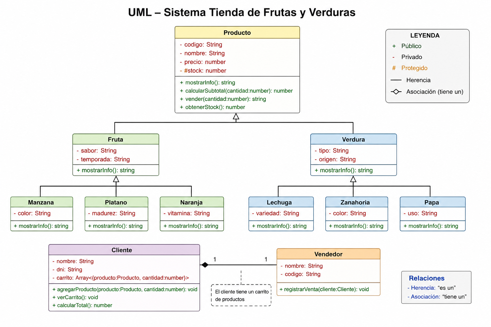

# Caso práctico completo de POO en JavaScript

## Sistema: Tienda de frutas y verduras


---

# Herencia del sistema

```text
Producto
   ↓
Fruta
   ↓
Manzana
```

```text
Producto
   ↓
Verdura
   ↓
Lechuga
```

Aquí se aplica herencia en 2 grados.

---

# Código completo

```js
class Producto {

    #stock;

    constructor(codigo, nombre, precio, stock) {
        this.codigo = codigo;
        this.nombre = nombre;
        this.precio = precio;
        this.#stock = stock;
    }

    mostrarInfo() {
        return `${this.codigo} - ${this.nombre} - S/ ${this.precio}`;
    }

    calcularSubtotal(cantidad) {
        return this.precio * cantidad;
    }

    vender(cantidad) {

        if (cantidad <= this.#stock) {
            this.#stock -= cantidad;
            return "Venta realizada";
        }

        return "Stock insuficiente";

    }

    obtenerStock() {
        return this.#stock;
    }

}
```

---

# Clase Fruta

```js
class Fruta extends Producto {

    constructor(codigo, nombre, precio, stock, sabor, temporada) {
        super(codigo, nombre, precio, stock);

        this.sabor = sabor;
        this.temporada = temporada;
    }

    mostrarInfo() {
        return `${this.nombre} | Fruta | Sabor: ${this.sabor} | Temporada: ${this.temporada} | S/ ${this.precio}`;
    }

}
```

---

# Clase Verdura

```js
class Verdura extends Producto {

    constructor(codigo, nombre, precio, stock, tipo, origen) {
        super(codigo, nombre, precio, stock);

        this.tipo = tipo;
        this.origen = origen;
    }

    mostrarInfo() {
        return `${this.nombre} | Verdura | Tipo: ${this.tipo} | Origen: ${this.origen} | S/ ${this.precio}`;
    }

}
```

---

# 3 frutas

## Manzana

```js
class Manzana extends Fruta {

    constructor(codigo, nombre, precio, stock, sabor, temporada, color) {
        super(codigo, nombre, precio, stock, sabor, temporada);

        this.color = color;
    }

    mostrarInfo() {
        return `${this.nombre} ${this.color} | Fruta | ${this.sabor} | S/ ${this.precio}`;
    }

}
```

## Platano

```js
class Platano extends Fruta {

    constructor(codigo, nombre, precio, stock, sabor, temporada, madurez) {
        super(codigo, nombre, precio, stock, sabor, temporada);

        this.madurez = madurez;
    }

    mostrarInfo() {
        return `${this.nombre} | Fruta | Madurez: ${this.madurez} | S/ ${this.precio}`;
    }

}
```

## Naranja

```js
class Naranja extends Fruta {

    constructor(codigo, nombre, precio, stock, sabor, temporada, vitamina) {
        super(codigo, nombre, precio, stock, sabor, temporada);

        this.vitamina = vitamina;
    }

    mostrarInfo() {
        return `${this.nombre} | Fruta | Vitamina: ${this.vitamina} | S/ ${this.precio}`;
    }

}
```

---

# 3 verduras

## Lechuga

```js
class Lechuga extends Verdura {

    constructor(codigo, nombre, precio, stock, tipo, origen, variedad) {
        super(codigo, nombre, precio, stock, tipo, origen);

        this.variedad = variedad;
    }

    mostrarInfo() {
        return `${this.nombre} | Verdura | Variedad: ${this.variedad} | S/ ${this.precio}`;
    }

}
```

## Zanahoria

```js
class Zanahoria extends Verdura {

    constructor(codigo, nombre, precio, stock, tipo, origen, color) {
        super(codigo, nombre, precio, stock, tipo, origen);

        this.color = color;
    }

    mostrarInfo() {
        return `${this.nombre} ${this.color} | Verdura | S/ ${this.precio}`;
    }

}
```

## Papa

```js
class Papa extends Verdura {

    constructor(codigo, nombre, precio, stock, tipo, origen, uso) {
        super(codigo, nombre, precio, stock, tipo, origen);

        this.uso = uso;
    }

    mostrarInfo() {
        return `${this.nombre} | Verdura | Uso: ${this.uso} | S/ ${this.precio}`;
    }

}
```

---

# Clase Cliente

```js
class Cliente {

    constructor(nombre, dni) {
        this.nombre = nombre;
        this.dni = dni;
        this.carrito = [];
    }

    agregarProducto(producto, cantidad) {

        this.carrito.push({
            producto,
            cantidad
        });

    }

    verCarrito() {

        console.log("Carrito de:", this.nombre);

        this.carrito.forEach(item => {
            console.log(
                item.producto.mostrarInfo() +
                " | Cantidad: " +
                item.cantidad
            );
        });

    }

    calcularTotal() {

        let total = 0;

        this.carrito.forEach(item => {
            total += item.producto.calcularSubtotal(item.cantidad);
        });

        return total;

    }

}
```

---

# Clase Vendedor

```js
class Vendedor {

    constructor(nombre, codigo) {
        this.nombre = nombre;
        this.codigo = codigo;
    }

    registrarVenta(cliente) {

        console.log("Vendedor:", this.nombre);
        console.log("Cliente:", cliente.nombre);

        cliente.carrito.forEach(item => {
            console.log(
                item.producto.vender(item.cantidad)
            );
        });

        console.log(
            "Total pagado: S/ " + cliente.calcularTotal()
        );

    }

}
```

---

# Ejecución del sistema

```js
const manzana = new Manzana(
    "F001",
    "Manzana",
    3.50,
    30,
    "Dulce",
    "Todo el año",
    "Roja"
);

const platano = new Platano(
    "F002",
    "Plátano",
    2.80,
    40,
    "Dulce",
    "Todo el año",
    "Maduro"
);

const naranja = new Naranja(
    "F003",
    "Naranja",
    4.00,
    25,
    "Cítrico",
    "Invierno",
    "Vitamina C"
);

const lechuga = new Lechuga(
    "V001",
    "Lechuga",
    2.50,
    20,
    "Hoja",
    "Lima",
    "Americana"
);

const zanahoria = new Zanahoria(
    "V002",
    "Zanahoria",
    3.20,
    35,
    "Raíz",
    "Junín",
    "Naranja"
);

const papa = new Papa(
    "V003",
    "Papa",
    2.90,
    50,
    "Tubérculo",
    "Huánuco",
    "Fritura"
);

const cliente = new Cliente(
    "Daniel",
    "12345678"
);

const vendedor = new Vendedor(
    "Carlos",
    "VEN001"
);

cliente.agregarProducto(manzana, 4);
cliente.agregarProducto(platano, 6);
cliente.agregarProducto(naranja, 3);
cliente.agregarProducto(lechuga, 2);
cliente.agregarProducto(zanahoria, 5);
cliente.agregarProducto(papa, 8);

cliente.verCarrito();

console.log(
    "Total preliminar: S/ " + cliente.calcularTotal()
);

vendedor.registrarVenta(cliente);

console.log("Stock manzana:", manzana.obtenerStock());
console.log("Stock plátano:", platano.obtenerStock());
console.log("Stock naranja:", naranja.obtenerStock());
console.log("Stock lechuga:", lechuga.obtenerStock());
console.log("Stock zanahoria:", zanahoria.obtenerStock());
console.log("Stock papa:", papa.obtenerStock());
```

---

# ¿Dónde se aplica cada concepto?

| Concepto | Aplicación |
|----------|------------|
| Clase | `Producto`, `Fruta`, `Verdura`, `Manzana`, `Platano`, `Naranja`, `Lechuga`, `Zanahoria`, `Papa`, `Cliente`, `Vendedor` |
| Objeto | `manzana`, `platano`, `naranja`, `lechuga`, `zanahoria`, `papa`, `cliente`, `vendedor` |
| Instancia | Cada objeto creado con `new` |
| Constructor | Inicializa valores de cada clase |
| `this` | Representa al objeto actual |
| `super` | Llama al constructor de la clase padre |
| `extends` | Permite heredar de otra clase |
| Encapsulamiento | `#stock` está protegido |
| Abstracción | El vendedor usa `registrarVenta()` sin conocer toda la lógica interna |
| Herencia | `Fruta` y `Verdura` heredan de `Producto` |
| Herencia en 2 grados | `Manzana` hereda de `Fruta`, que hereda de `Producto` |
| Polimorfismo | `mostrarInfo()` cambia según cada producto |
| Composición | `Cliente` tiene un `carrito` |
| Arreglo de objetos | `carrito` guarda productos y cantidades |
| Estado del objeto | El stock cambia después de vender |

---

# Resumen

Este caso representa una tienda donde:

- `Producto` es la clase principal.
- `Fruta` y `Verdura` son tipos de producto.
- Hay 3 frutas: `Manzana`, `Platano`, `Naranja`.
- Hay 3 verduras: `Lechuga`, `Zanahoria`, `Papa`.
- Existe un cliente.
- Existe un vendedor.
- El cliente agrega productos al carrito.
- El vendedor registra la venta.
- El sistema calcula el total.
- El sistema descuenta stock.